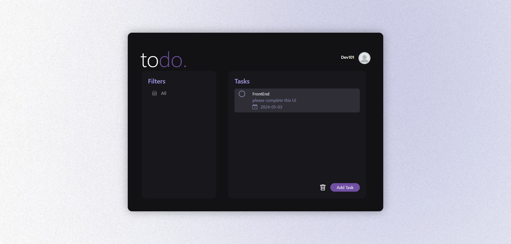
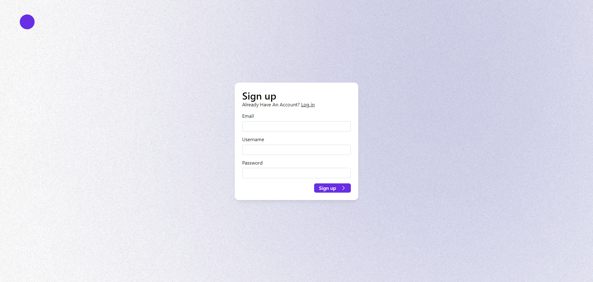

# ToDo List Application (REST API)

This repository contains a ToDo List application built with native PHP and PDO for database interactions. The application implements user authentication (signup and sign-in) and CRUD functionalities for managing tasks.

 
## Features

*   **User Authentication:**
    *   Sign up with email and password
    *   Sign in to access ToDo list functionalities
*   **Task Management:**
    *   Create new tasks
    *   View list of all tasks
    *   View individual task details
    *   Edit existing tasks (using JavaScript PUT request)
    *   Delete tasks (using JavaScript DELETE request)

## Technical Details

*   **Backend:** PHP (native)
*   **Database:** Any database supported by PDO (MySQL, PostgreSQL, etc.)
*   **Dependency Injection:** Implemented using a custom container for managing dependencies.
*   **Routing:** Custom routing mechanism to map URLs to controllers and actions.
*   **JavaScript:** Used for sending PUT and DELETE requests for task updates and deletions.

## API Routes

The following table describes the available API routes:

| **Method** | **Route**           | **Controller**       | **Action**           | **Description**                                                                        |
| :--------- | :------------------ | :------------------- | :------------------- | :--------------------------------------------------------------------------------------------- |
| GET        | `/`                | HomeController       | index                | Renders the home page (landing page or task list - based on your implementation).       |
| GET        | `/signup`           | HomeController       | signup               | Renders the signup form.                                                                 |
| GET        | `/signin`           | HomeController       | signIn               | Renders the sign-in form.                                                                |
| POST       | `/signup`           | UserController      | signup               | Processes user registration.                                                            |
| POST       | `/signin`           | UserController      | signIn               | Processes user login.                                                                   |
| GET        | `/tasks`            | TodoController      | index                | Retrieves a list of all tasks for the authenticated user.                             |
| GET        | `/task/{id}`        | TodoController      | getTask             | Retrieves details of a specific task by ID.                                                |
| POST       | `/api/task`         | TodoController      | addTask             | Creates a new task.                                                                    |
| DELETE     | `/api/task`         | TodoController      | deleteTask          | Deletes a task (requires task ID to be sent in the request body).                      |
| PUT        | `/api/task/{id}`    | TodoController      | editTask            | Updates an existing task.                                                               |

## Installation and Setup

1.  **Clone the repository:** `git clone https://github.com/ramo4040/ToDo-List-application-PHP.git`
2.  **Configure database connection:** Update the database credentials in the `Database - Config` class.
3.  **Run the application:** Use a PHP built-in server or configure a web server like Apache or Nginx.

## Usage

1.  Access the application in your browser. http://localhost/todo/
2.  Sign up or sign in to access the ToDo list features.
3.  Create, view, edit, and delete tasks as needed.

## Contributing

Contributions are welcome! Please feel free to fork the repository and submit pull requests for bug fixes, improvements, or new features.

## Contact

<a href="https://www.linkedin.com/in/yassir-rouane/">Linkedin</a>
